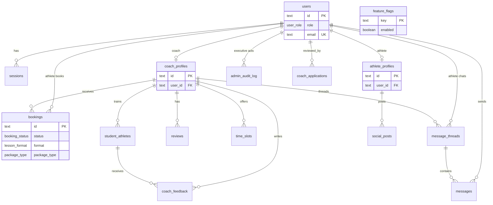

# AthLink データベース設計書

PostgreSQL 16 + Drizzle ORM による AthLink プラットフォームのスキーマ定義。  
ソース・オブ・トゥルース: `src/db/schema.ts`  
DDL リファレンス: [`schema.sql`](./schema.sql)

---

## 1. 概要

AthLink は野球特化のコーチマーケットプレイス + アスリート SNS + エグゼクティブ管理コンソールを統合した 3 層アーキテクチャ（Next.js / Route Handlers / PostgreSQL）です。本ドキュメントは **18 テーブル**（現行 Drizzle スキーマ）を対象とし、管理画面スタブで言及される将来テーブル（`ai_breakdown_jobs`, `reported_posts`, `reported_threads`）は SQL のみ `-- FUTURE` コメント付きで記載します。

### 設計原則

| 原則 | 説明 |
|------|------|
| **テキスト主キー** | すべての PK は `TEXT`（例: `u-athlete-1`, `c1`, `b-001`）。UUID ではなくアプリ側で生成する ID 文字列。 |
| **非正規化スナップショット** | `bookings.coach_name`, `message_threads.last_message` など、表示用に名前・要約を冗長保持。履歴表示の安定性を優先。 |
| **多言語 JSONB** | コーチ bio、レビュー comment、メッセージ body など `{ en, ja, es }` または文字列を `JSONB` で格納。 |
| **日時 vs 日付文字列** | 予約・スロットの `date` / `start_time` / `end_time` は **TEXT**（UI カレンダー連携の都合）。監査・セッションは **TIMESTAMPTZ**。 |
| **ロールベース認可** | `users.role` enum（`athlete`, `coach`, `parent`, `executive`）。RLS は使用せず **アプリ層**（Route Handler + `requireExecutive()`）で制御。 |
| **カスケード削除** | プロフィール・スレッド・学生など親子関係は `ON DELETE CASCADE`。予約・監査ログは参照のみ（履歴保持）。 |

---

## 2. ER 図



### ドメイン別グルーピング

```
[認証]           users ── sessions
[マーケット]     coach_profiles ── reviews, time_slots, bookings
[メッセージ]     message_threads ── messages
[アスリート/SNS] athlete_profiles ── social_posts
[コーチツール]   student_athletes ── coach_feedback
[分析]           analytics_events (疎結合)
[管理]           admin_audit_log, feature_flags, admin_alerts,
                 coach_applications, platform_config
```

---

## 3. ENUM 型

| PostgreSQL 型名 | 値 | 用途 |
|-----------------|-----|------|
| `user_role` | `athlete`, `coach`, `parent`, `executive` | ユーザー種別。`executive` は `/admin` 専用。公開 signup では `executive` 不可。 |
| `lesson_format` | `in_person`, `online` | 予約のレッスン形式。 |
| `booking_status` | `pending`, `confirmed`, `completed`, `cancelled` | 予約ライフサイクル。PATCH `/api/bookings/[id]` で更新。 |
| `package_type` | `single`, `pack`, `subscription` | 料金プラン種別。 |
| `social_post_type` | `form`, `practice`, `game`, `training`, `highlight` | SNS フィード投稿カテゴリ。 |

`coach_applications.status` は **TEXT**（`pending` デフォルト）。将来 Drizzle enum 化可能。

---

## 4. テーブル定義

### 4.1 `users` — ユーザー（認証主体）

| Column | Type | Constraints | 説明 |
|--------|------|-------------|------|
| `id` | TEXT | PK | ユーザー ID |
| `email` | TEXT | NOT NULL, UNIQUE | ログイン用メール（小文字化はアプリ側） |
| `password_hash` | TEXT | NOT NULL | bcrypt ハッシュ |
| `name` | TEXT | NOT NULL | 表示名 |
| `role` | user_role | NOT NULL | ロール |
| `avatar_url` | TEXT | | プロフィール画像 URL |
| `created_at` | TIMESTAMPTZ | NOT NULL, DEFAULT now() | 作成日時 |
| `updated_at` | TIMESTAMPTZ | NOT NULL, DEFAULT now() | 更新日時 |

**Indexes:** PK (`id`), UNIQUE (`email`)

**FK 参照元:** `sessions`, `coach_profiles`, `athlete_profiles`, `bookings`, `message_threads`, `messages`, `admin_audit_log`, `coach_applications.reviewed_by`, `platform_config.updated_by`

---

### 4.2 `sessions` — セッション（HttpOnly Cookie）

| Column | Type | Constraints | 説明 |
|--------|------|-------------|------|
| `id` | TEXT | PK | セッション ID |
| `user_id` | TEXT | NOT NULL, FK → users(id) ON DELETE CASCADE | 所有者 |
| `token` | TEXT | NOT NULL, UNIQUE | Cookie `athlink_session` に格納するトークン |
| `expires_at` | TIMESTAMPTZ | NOT NULL | 有効期限（30 日） |
| `created_at` | TIMESTAMPTZ | NOT NULL, DEFAULT now() | 作成日時 |

**Indexes:** PK, UNIQUE (`token`), 推奨 `sessions_user_id_idx`

---

### 4.3 `coach_profiles` — コーチ公開プロフィール

| Column | Type | Constraints | 説明 |
|--------|------|-------------|------|
| `id` | TEXT | PK | コーチプロフィール ID（`users.id` とは別） |
| `user_id` | TEXT | NOT NULL, FK → users(id) CASCADE | 紐付くユーザー |
| `name` | TEXT | NOT NULL | 表示名 |
| `email` | TEXT | NOT NULL | 連絡先 |
| `sport` | TEXT | NOT NULL | 競技（例: baseball） |
| `specialties` | JSONB | NOT NULL | 専門分野配列 `string[]` |
| `bio` | JSONB | NOT NULL | `{ en, ja, es }` |
| `location` | TEXT | NOT NULL | 表示用ロケーション |
| `city` | TEXT | NOT NULL | 市区 |
| `prefecture` | TEXT | NOT NULL | 都道府県 |
| `experience_years` | INTEGER | NOT NULL | 経験年数 |
| `price_per_hour` | REAL | NOT NULL | 時間単価 |
| `rating` | REAL | NOT NULL | 平均評価 |
| `review_count` | INTEGER | NOT NULL | レビュー数 |
| `verified` | BOOLEAN | NOT NULL, DEFAULT false | 認証バッジ |
| `formats` | JSONB | NOT NULL | `("in_person"\|"online")[]` |
| `avatar_url` | TEXT | NOT NULL | アバター |
| `cover_gradient` | TEXT | NOT NULL | カバー CSS グラデーション |
| `career` | JSONB | NOT NULL | 経歴 `{ en, ja, es }[]` |
| `languages` | JSONB | NOT NULL | 対応言語 `string[]` |
| `availability_note` | TEXT | NOT NULL | 空き状況メモ |
| `created_at` | TIMESTAMPTZ | NOT NULL, DEFAULT now() | |
| `updated_at` | TIMESTAMPTZ | NOT NULL, DEFAULT now() | |

**FK 参照元:** `reviews`, `time_slots`, `bookings`, `message_threads`, `student_athletes`, `coach_feedback`

---

### 4.4 `reviews` — コーチレビュー

| Column | Type | Constraints | 説明 |
|--------|------|-------------|------|
| `id` | TEXT | PK | |
| `coach_id` | TEXT | NOT NULL, FK → coach_profiles(id) CASCADE | |
| `author_name` | TEXT | NOT NULL | 投稿者名（匿名可） |
| `rating` | REAL | NOT NULL | 1–5 |
| `comment` | JSONB | NOT NULL | 多言語コメント |
| `date` | TEXT | NOT NULL | 表示用日付文字列 |
| `athlete_level` | TEXT | NOT NULL | 例: high_school |

---

### 4.5 `time_slots` — 予約可能スロット

| Column | Type | Constraints | 説明 |
|--------|------|-------------|------|
| `id` | TEXT | PK | |
| `coach_id` | TEXT | NOT NULL, FK → coach_profiles(id) CASCADE | |
| `date` | TEXT | NOT NULL | `YYYY-MM-DD` |
| `start_time` | TEXT | NOT NULL | 例: `09:00` |
| `end_time` | TEXT | NOT NULL | |
| `available` | BOOLEAN | NOT NULL, DEFAULT true | 予約可否 |

**推奨 Index:** `(coach_id, date)`

---

### 4.6 `bookings` — レッスン予約

| Column | Type | Constraints | 説明 |
|--------|------|-------------|------|
| `id` | TEXT | PK | |
| `coach_id` | TEXT | NOT NULL, FK → coach_profiles(id) | CASCADE なし（履歴保持） |
| `coach_name` | TEXT | NOT NULL | スナップショット |
| `athlete_id` | TEXT | NOT NULL, FK → users(id) | |
| `athlete_name` | TEXT | NOT NULL | スナップショット |
| `date` | TEXT | NOT NULL | |
| `start_time` | TEXT | NOT NULL | |
| `end_time` | TEXT | NOT NULL | |
| `format` | lesson_format | NOT NULL | |
| `package_type` | package_type | NOT NULL | |
| `price` | REAL | NOT NULL | |
| `status` | booking_status | NOT NULL | |
| `note` | TEXT | | 任意メモ |
| `created_at` | TIMESTAMPTZ | NOT NULL | 作成日時（seed では明示設定） |

**API:** GET/POST `/api/bookings`, PATCH `/api/bookings/[id]`, GET `/api/admin/bookings`

---

### 4.7 `message_threads` — コーチ↔アスリート会話スレッド

| Column | Type | Constraints | 説明 |
|--------|------|-------------|------|
| `id` | TEXT | PK | |
| `coach_id` | TEXT | NOT NULL, FK → coach_profiles(id) CASCADE | |
| `coach_name` | TEXT | NOT NULL | |
| `athlete_id` | TEXT | NOT NULL, FK → users(id) CASCADE | |
| `athlete_name` | TEXT | NOT NULL | |
| `last_message` | JSONB | NOT NULL | 最新メッセージ要約（多言語） |
| `updated_at` | TIMESTAMPTZ | NOT NULL | ソート用 |
| `unread` | INTEGER | NOT NULL, DEFAULT 0 | 未読数 |

**Feature flag:** `athlete_coach_messaging`

---

### 4.8 `messages` — スレッド内メッセージ

| Column | Type | Constraints | 説明 |
|--------|------|-------------|------|
| `id` | TEXT | PK | |
| `thread_id` | TEXT | NOT NULL, FK → message_threads(id) CASCADE | |
| `sender_id` | TEXT | NOT NULL, FK → users(id) | |
| `sender_name` | TEXT | NOT NULL | |
| `sender_name_key` | TEXT | | i18n キー（任意） |
| `body` | JSONB | NOT NULL | 多言語オブジェクトまたは文字列 |
| `created_at` | TIMESTAMPTZ | NOT NULL | |

---

### 4.9 `athlete_profiles` — アスリート公開プロフィール

| Column | Type | Constraints | 説明 |
|--------|------|-------------|------|
| `id` | TEXT | PK | |
| `user_id` | TEXT | NOT NULL, FK → users(id) CASCADE | |
| `name` | TEXT | NOT NULL | |
| `email` | TEXT | NOT NULL | |
| `school` | TEXT | NOT NULL | |
| `class_year` | TEXT | NOT NULL | 例: 2027 |
| `height` | TEXT | NOT NULL | |
| `weight` | TEXT | NOT NULL | |
| `position` | TEXT | NOT NULL | |
| `bats_throws` | TEXT | NOT NULL | |
| `location` | TEXT | NOT NULL | |
| `bio` | TEXT | NOT NULL | |
| `avatar_url` | TEXT | NOT NULL | |
| `season_stats` | JSONB | NOT NULL | シーズン成績オブジェクト |
| `looking_for_coach` | BOOLEAN | NOT NULL, DEFAULT false | コーチ募集中 |
| `open_to_scouts` | BOOLEAN | NOT NULL, DEFAULT false | スカウト公開 |

**Feature flag:** `scout_discovery`

---

### 4.10 `social_posts` — トレーニングフィード投稿

| Column | Type | Constraints | 説明 |
|--------|------|-------------|------|
| `id` | TEXT | PK | |
| `athlete_id` | TEXT | NOT NULL, FK → athlete_profiles(id) CASCADE | |
| `athlete_name` | TEXT | NOT NULL | 非正規化 |
| `school` | TEXT | NOT NULL | |
| `position` | TEXT | NOT NULL | |
| `class_year` | TEXT | NOT NULL | |
| `avatar_url` | TEXT | NOT NULL | |
| `type` | social_post_type | NOT NULL | |
| `caption` | TEXT | NOT NULL | |
| `video_url` | TEXT | NOT NULL | |
| `poster_url` | TEXT | NOT NULL | サムネイル |
| `stats_note` | TEXT | | 任意統計メモ |
| `created_at` | TIMESTAMPTZ | NOT NULL | |
| `likes` | INTEGER | NOT NULL, DEFAULT 0 | |

**Feature flag:** `training_feed`

---

### 4.11 `student_athletes` — コーチ管理下の生徒（レッスン CRM）

| Column | Type | Constraints | 説明 |
|--------|------|-------------|------|
| `id` | TEXT | PK | |
| `coach_id` | TEXT | NOT NULL, FK → coach_profiles(id) CASCADE | |
| `name` | TEXT | NOT NULL | |
| `age` | INTEGER | NOT NULL | |
| `level` | TEXT | NOT NULL | |
| `position` | TEXT | NOT NULL | |
| `parent_name` | TEXT | | 保護者名（任意） |
| `location` | TEXT | NOT NULL | |
| `avatar_url` | TEXT | NOT NULL | |
| `lessons_completed` | INTEGER | NOT NULL | |
| `next_lesson` | TEXT | | 次回レッスン表示文字列 |
| `focus_areas` | JSONB | NOT NULL | `string[]` |
| `ai_summary` | TEXT | NOT NULL | AI 要約 |
| `strengths` | JSONB | NOT NULL | `string[]` |
| `improvements` | JSONB | NOT NULL | `string[]` |
| `metrics` | JSONB | NOT NULL | パフォーマンス指標 |
| `history` | JSONB | NOT NULL | 履歴イベント |
| `last_session_note` | TEXT | NOT NULL | |
| `lesson_log` | JSONB | NOT NULL | レッスンログ |

**Note:** `users` テーブルとは独立。コーチダッシュボード専用 CRM データ。

---

### 4.12 `coach_feedback` — コーチ→生徒フィードバック

| Column | Type | Constraints | 説明 |
|--------|------|-------------|------|
| `id` | TEXT | PK | |
| `coach_id` | TEXT | NOT NULL, FK → coach_profiles(id) CASCADE | |
| `student_id` | TEXT | NOT NULL, FK → student_athletes(id) CASCADE | |
| `student_name` | TEXT | NOT NULL | |
| `subject` | TEXT | NOT NULL | 件名 |
| `body` | TEXT | NOT NULL | 本文 |
| `created_at` | TIMESTAMPTZ | NOT NULL | |
| `ai_attached` | BOOLEAN | NOT NULL, DEFAULT false | AI 分析添付フラグ |

---

### 4.13 `analytics_events` — MVP 分析イベント

| Column | Type | Constraints | 説明 |
|--------|------|-------------|------|
| `id` | TEXT | PK | |
| `name` | TEXT | NOT NULL | イベント名（例: `profile_view`） |
| `user_id` | TEXT | | 任意 |
| `coach_id` | TEXT | | 任意 |
| `path` | TEXT | | ページパス |
| `props` | JSONB | | `Record<string, string>` |
| `created_at` | TIMESTAMPTZ | NOT NULL, DEFAULT now() | |

**API:** POST `/api/events`  
**用途:** ファネル、プロフィール閲覧、予約開始など。

---

### 4.14 `admin_audit_log` — エグゼクティブ監査ログ

| Column | Type | Constraints | 説明 |
|--------|------|-------------|------|
| `id` | TEXT | PK | |
| `admin_user_id` | TEXT | NOT NULL, FK → users(id) | 実行者（executive） |
| `action` | TEXT | NOT NULL | 例: `feature_flag.toggle` |
| `target_type` | TEXT | | 対象種別 |
| `target_id` | TEXT | | 対象 ID |
| `metadata` | JSONB | | 追加コンテキスト |
| `created_at` | TIMESTAMPTZ | NOT NULL, DEFAULT now() | |

**書き込み:** `lib/admin/audit.ts` → `logAdminAction()`  
**閲覧:** GET `/api/admin/audit`, `/admin/audit`

---

### 4.15 `feature_flags` — 機能フラグ

| Column | Type | Constraints | 説明 |
|--------|------|-------------|------|
| `key` | TEXT | PK | フラグキー |
| `enabled` | BOOLEAN | NOT NULL, DEFAULT false | 有効/無効 |
| `rollout_percent` | INTEGER | NOT NULL, DEFAULT 100 | ロールアウト率 0–100 |
| `audience` | TEXT | NOT NULL, DEFAULT `'all'` | 対象オーディエンス |
| `audience_ids` | JSONB | | 特定ユーザー ID リスト |
| `updated_at` | TIMESTAMPTZ | NOT NULL, DEFAULT now() | |

**既知キー（seed）:**

| key | デフォルト | 用途 |
|-----|-----------|------|
| `booking_flow` | enabled | 予約フロー |
| `training_feed` | enabled | SNS フィード |
| `ai_breakdown` | disabled | AI 動画分析（将来） |
| `athlete_coach_messaging` | enabled | DM |
| `scout_discovery` | enabled | スカウト発見 |
| `homepage_gateway` | enabled | ランディングゲートウェイ |

**API:** GET `/api/feature-flags`, GET/PATCH `/api/admin/feature-flags`

---

### 4.16 `admin_alerts` — 管理ダッシュボードアラート

| Column | Type | Constraints | 説明 |
|--------|------|-------------|------|
| `id` | TEXT | PK | |
| `kind` | TEXT | NOT NULL | 例: `coach_application` |
| `title` | TEXT | NOT NULL | |
| `detail` | TEXT | | |
| `severity` | TEXT | NOT NULL, DEFAULT `'info'` | info / warning / error |
| `resolved` | BOOLEAN | NOT NULL, DEFAULT false | |
| `metadata` | JSONB | | |
| `created_at` | TIMESTAMPTZ | NOT NULL, DEFAULT now() | |

**表示:** GET `/api/admin/overview`

---

### 4.17 `coach_applications` — コーチ応募キュー

| Column | Type | Constraints | 説明 |
|--------|------|-------------|------|
| `id` | TEXT | PK | |
| `external_id` | TEXT | | Jotform 等の外部 ID |
| `name` | TEXT | NOT NULL | |
| `email` | TEXT | NOT NULL | |
| `area` | TEXT | NOT NULL | 活動エリア |
| `specialty` | TEXT | NOT NULL | 専門 |
| `years_experience` | INTEGER | NOT NULL, DEFAULT 0 | |
| `status` | TEXT | NOT NULL, DEFAULT `'pending'` | pending / approved / rejected 等 |
| `documents` | JSONB | | 書類 URL マップ |
| `notes` | TEXT | | 内部メモ |
| `submitted_at` | TIMESTAMPTZ | NOT NULL, DEFAULT now() | |
| `reviewed_at` | TIMESTAMPTZ | | |
| `reviewed_by` | TEXT | FK → users(id) | 審査者 |

**API:** GET `/api/admin/coaches`, PATCH `/api/admin/applications`

---

### 4.18 `platform_config` — プラットフォーム設定（JSON）

| Column | Type | Constraints | 説明 |
|--------|------|-------------|------|
| `key` | TEXT | PK | 設定キー |
| `value` | JSONB | NOT NULL | 任意 JSON 値 |
| `updated_at` | TIMESTAMPTZ | NOT NULL, DEFAULT now() | |
| `updated_by` | TEXT | FK → users(id) | 最終更新者 |

**用途:** 料金、都市リスト、閾値など。seed では未投入（`/admin/config` で将来編集）。

---

## 5. 将来テーブル（Drizzle 未実装）

管理 UI スタブのみ存在。`docs/schema.sql` に `-- FUTURE` コメント付き DDL を記載。

| Table | 用途 | 参照 |
|-------|------|------|
| `ai_breakdown_jobs` | 動画アップロード → AI バイオメカニクス分析キュー | `/admin/ai` |
| `reported_posts` | SNS 投稿のユーザーレポート | `/admin/moderation` |
| `reported_threads` | メッセージスレッドのレポート | `/admin/moderation` |

---

## 6. RLS（Row Level Security）について

**本アプリは Supabase RLS を使用しません。**

- 認証: HttpOnly Cookie + `sessions` テーブル
- 認可: Next.js Route Handler 内の `getSession()` / `requireExecutive()` 等
- DB 接続: サーバー側単一 `DATABASE_URL`（フル権限）

PostgreSQL RLS を有効化する場合は、別途 `SET ROLE` / JWT クレーム連携が必要です。現行 MVP では **アプリ層認可** を前提とした設計です。

---

## 7. シードデータ概要

コマンド: `npm run db:push && npm run db:seed`（`src/db/seed.ts`）

| 対象 | 内容 |
|------|------|
| **TRUNCATE** | 全 18 テーブル（依存順、`RESTART IDENTITY CASCADE`） |
| **users** | エグゼクティブ 1、コーチ（`lib/data`）、アスリート（`lib/social-data`）、追加アスリート 1 |
| **パスワード** | 全デモアカウント: `Athlink2026!` |
| **coach_profiles** | `lib/data` のコーチ一覧 |
| **reviews, time_slots, bookings** | 静的デモデータ |
| **message_threads, messages** | デモ会話 |
| **athlete_profiles, social_posts** | SNS デモ |
| **student_athletes, coach_feedback** | コーチ c1 配下の生徒 CRM |
| **feature_flags** | 6 キー（上表） |
| **coach_applications** | 2 件 pending |
| **admin_alerts** | 1 件（新規応募通知） |
| **未シード** | `analytics_events`, `admin_audit_log`, `platform_config`, `sessions` |

**デモアカウント:**

| Role | Email |
|------|-------|
| executive | `ceo@athlink.app` |
| coach | `tanaka@athlink.app` |
| athlete | `ethan.park@athlink.app` |

---

## 8. マイグレーション戦略

### 推奨: `drizzle-kit push`

```bash
# ローカル
docker compose up -d
cp .env.example .env.local
npm run db:push      # schema.ts → PostgreSQL 同期
npm run db:seed      # デモデータ投入
```

| Script | 説明 |
|--------|------|
| `npm run db:push` | `drizzle-kit push` — 開発・MVP 向け。`src/db/schema.ts` を DB に直接反映 |
| `npm run db:generate` | `drizzle-kit generate` — `drizzle/` に SQL マイグレーションファイル生成 |
| `npm run db:studio` | Drizzle Studio GUI |
| `npm run db:seed` | デモデータ再投入 |

**本番初回:**

```bash
DATABASE_URL="postgresql://..." npm run db:push
DATABASE_URL="postgresql://..." npm run db:seed   # 任意
```

**方針:**

1. スキーマ変更は **必ず** `src/db/schema.ts` を先に更新
2. ローカルで `db:push` → 動作確認 → 本番 `db:push`
3. 本番で破壊的変更が必要な場合は `db:generate` でレビュー可能な SQL を生成
4. `docs/schema.sql` は **参照用 DDL**（手動 `psql -f` も可）。Drizzle push との差分は追加インデックス（`schema.sql` の推奨 index）のみ

### Drizzle 設定

`drizzle.config.ts`:

- schema: `./src/db/schema.ts`
- out: `./drizzle`
- dialect: `postgresql`

---

## 9. 機能 ↔ テーブル対応

| 機能 | 主要テーブル |
|------|-------------|
| 認証 / サインアップ | `users`, `sessions` |
| コーチ検索・詳細 | `coach_profiles`, `reviews`, `time_slots` |
| 予約 | `bookings`, `time_slots` |
| メッセージ | `message_threads`, `messages` |
| アスリートプロフィール | `athlete_profiles` |
| SNS フィード | `social_posts` |
| コーチ CRM | `student_athletes`, `coach_feedback` |
| 分析 | `analytics_events` |
| 管理コンソール | `admin_audit_log`, `admin_alerts`, `feature_flags`, `platform_config` |
| コーチ応募 | `coach_applications` |
| AI 分析（将来） | `ai_breakdown_jobs` (FUTURE) |
| モデレーション（将来） | `reported_posts`, `reported_threads` (FUTURE) |

---

## 10. 関連ドキュメント

- [BACKEND.md](./BACKEND.md) — API・クイックスタート
- [admin.md](./admin.md) — エグゼクティブ管理コンソール
- [DEPLOY.md](./DEPLOY.md) — 本番デプロイ
- [`schema.sql`](./schema.sql) — PostgreSQL DDL
