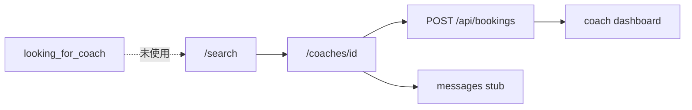
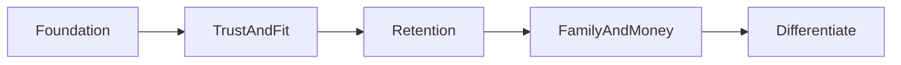

# AthlinkPro マッチング進行計画書

**作成日:** 2026年9月  
**位置づけ:** プロダクト機能の正本。実装はこの文書のフェーズ順に従う。  
**対象外:** UI の見た目は [ROADMAP-UI-PREMIUM.md](./ROADMAP-UI-PREMIUM.md)、情報設計は [IA.md](./IA.md)、デプロイ手順は [DEPLOY.md](./DEPLOY.md)。衝突時は、機能優先度は本計画、見た目は UI 計画、導線は IA が勝つ。

**関連する今後の指示文:** [AGENT-INSTRUCTIONS-MATCHING.md](./AGENT-INSTRUCTIONS-MATCHING.md)

---

## 1. 現行モデル（ここから逸脱しない）

AthlinkPro は **NCSA / Hudl のクローンではなく、カリフォルニア野球の個人レッスン市場** である。Layer 1 MVP のコアループは次のとおり。

1. 未ログインでも `/search` で在庫を見る（[IA.md](./IA.md)）
2. `/coaches/[id]` または `/c/[coachId]` でプロフィールとスロットを見る
3. `POST /api/bookings` で予約する
4. 選手は `/bookings`、コーチは `/coach/dashboard` で確認する

### 1.1 制約

| 項目 | 現行 |
|------|------|
| 地理・競技 | カリフォルニア、野球（hitting / pitching 等） |
| マッチング | アルゴリズムなし。[src/lib/search.ts](../src/lib/search.ts) の `filterCoaches()` と手動予約のみ。`matches` テーブルは無い |
| ロール | `athlete` / `coach` / `parent`（スキーマのみ） / `executive` |
| 決済 | Layer 1 対象外。Stripe は env スタブのみ（[DEPLOY.md](./DEPLOY.md)） |
| 認証 | Clerk UI と cookie セッション `users` が未ブリッジ |
| データ | [src/db/schema.ts](../src/db/schema.ts) に messaging / SNS / CRM / reviews はあるが、多くは localStorage または seed 表示 |
| IA | Marketing HQ / 役割 LP / App の3層。ログイン前検索は隠さない |

### 1.2 今日の予約の事実

`createBooking`（[src/lib/server/data.ts](../src/lib/server/data.ts)）は予約を即 `confirmed` にする。[DEPLOY.md](./DEPLOY.md) の「コーチがダッシュボードで確認する」と食い違っている。Trust and Fit フェーズで `pending` をデフォルトにする。

### 1.3 スキーマにあるが未配線のもの（新テーブルより先に使う）

| テーブル / 列 | 状態 | 載せる画面 |
|---------------|------|------------|
| `athlete_profiles`（`looking_for_coach`, `open_to_scouts`） | オンボーディングは localStorage | `/join/athlete`, `/athletes/[id]`, `/search` 推薦 |
| `message_threads` / `messages` | seed のみ。公開 API なし | `/messages` |
| `reviews` | 表示のみ。投稿 API なし | `/coaches/[id]` |
| `time_slots` | 登録時に14日分自動生成 | `/coach/calendar` |
| `student_athletes` / `coach_feedback` | UI は静的 [src/lib/coach-students.ts](../src/lib/coach-students.ts) | `/coach/dashboard` |
| `social_posts` | SNS は localStorage | `/sns`, `/feed` |
| `coach_applications` | admin キューあり、Jotform なし | `/admin` |
| `coach_profiles.verified` | 自己申告に近い | 検索バッジ、審査後に立てる |
| `feature_flags` | admin で切替可。`useFeatureFlag` はページ未使用 | 各面の露出制御 |

将来テーブル（SQL の `-- FUTURE` のみ）: `ai_breakdown_jobs`, `reported_posts`, `reported_threads`。Foundation 完了前に作らない。

---

## 2. 競合の見方（全部真似しない）

市場を5カテゴリに分け、**現行モデルに載る要素だけ採用**する。

### A. レッスン市場（最も近い）

CoachUp / TeachMe.To / TakeLessons / Superprof / ドリームコーチング

- 採る: 目標入力からの推薦、身元確認、返信 SLA、体験レッスン、完了後レビュー、即時予約、パッケージ、安心保証のコピー
- 採らない: 全競技横断の在庫拡大、連絡課金（Superprof Student Pass）、高額掲載料を先に入れること

### B. リクルーティング

NCSA / SportsRecruits / FieldLevel / Perfect Game

- 採る: 選手プロフィールの可視化、`open_to_scouts`、動画、閲覧の透明性（Differentiate）
- 採らない: 大学コーチ DB、有料リクルート伴走、scholarship matching。`/sns` の Scout タブは既存資産として残すが本業にしない

### C. チーム / 動画オペ

Hudl / CoachNow / TeamSnap / OnForm

- 採る: レッスン後フィードバック、動画1本＋メモ、出欠、選手 CRM（`student_athletes` / `coach_feedback`）
- 採らない: チーム戦術ボード、本格モーション解析（`/admin/ai` は Differentiate）

### D. 汎用2sided

Airbnb / ClassPass

- 採る: 先に在庫、信頼バッジ、ホスト応答率、相互レビュー（後段）、Instant Book vs 承認予約
- 採らない: クレジット制サブスクでコーチをコモディティ化すること

### E. 日本・言語

ドリームコーチング / コーチングサーチ

- 採る: 体験セッション導線、資格・実績の見せ方、EN / JA / ES の bio・レビュー
- 採らない: メンタルトレーニング汎用コーチの在庫化

---

## 3. 適応判断

各項目は **採用 / 延期 / 拒否** のいずれか。採用は現行ファイルへの載せ方まで固定する。

### 3.1 採用（現行モデルに載せる）

| 項目 | 出典 | 載せ方 |
|------|------|--------|
| 目標ベース推薦 | CoachUp | オンボーディングの `lookingForCoach` / position / specialty を `filterCoaches()` のスコアに接続。`matches` テーブルは作らない |
| 信頼バッジ | CoachUp / Airbnb | `coach_profiles.verified` を審査後のみ true。`coach_applications` + `/admin` を本番導線にする |
| 返信 SLA | CoachUp（48時間） | `message_threads` を API 化し応答時間を計測。表示は feature flag |
| 体験レッスン / Good-Fit | CoachUp / ドリームコーチング | 決済前は「初回無料枠」の運用コピー。`package_type` に `trial` を足すかは Trust and Fit で判断。実返金は延期 |
| 完了後レビュー | Superprof / TeachMe.To | `reviews` 投稿 API。予約 `completed` 後のみ。相互レビューは後段 |
| Instant Book vs 承認 | Airbnb / TeachMe.To | 予約デフォルトを `pending`。verified + Instant Book フラグで即 `confirmed` |
| カレンダー実在庫 | TeachMe.To | `time_slots` 編集を `/coach/calendar` に接続。14日自動生成だけにしない |
| 永続メッセージ | 市場標準 | `/api/messages` を新設し `/messages` の静的 seed を外す |
| 選手 CRM | CoachNow | `student_athletes` をダッシュボードに接続し静的データを置換 |
| 親ロール（薄い） | 市場標準 | 決済前は子の予約代行（閲覧/予約）まで |
| 認証一本化 | 内部前提 | Clerk ↔ Postgres（UI 計画 Phase 4）。マッチング実装の前提 |

### 3.2 延期（モデルは合うが Layer 1 を壊す）

- Stripe、返金保証の実運用、保険、バックグラウンドチェック業者接続
- 本格レコメンドエンジン、`matches` エンティティ
- 大学スカウト CRM、プロフィール閲覧トラッキング
- AI スイング解析、モデレーション本番
- 競技・州の拡大

### 3.3 拒否（現行モデルと衝突）

- ClassPass 型のクレジット消費でコーチをコモディティ化すること
- Superprof 型のメッセージ課金で検索体験を閉じること
- NCSA 型の有料リクルート伴走を本業にすること
- ログイン必須で在庫を隠すこと（IA 違反）

---

## 4. フェーズ

基盤を先に閉じ、差別化は後。UI Premium と並行してよいが、機能の依存はこの順を崩さない。

### Phase 1 — Foundation

目的: デモ localStorage を増やさず、既存テーブルを API に載せる。Clerk ユーザーが Postgres にいる状態にする。

- Clerk ↔ `users` ブリッジ（ロール、avatar）
- 選手オンボーディングを `athlete_profiles` に POST
- `/api/messages`（threads + messages）と `/messages` の接続
- `student_athletes` / `coach_feedback` をコーチダッシュボードに接続
- ページで `useFeatureFlag` を実際に使う（初期キー: `booking_flow`, `training_feed`, `athlete_coach_messaging`, `scout_discovery`, `ai_breakdown`）
- `/join/*` と Clerk `/sign-up`、`/coach/register` の一本化方針を実装に落とす（[IA.md](./IA.md) 残課題）

完了条件:

- デモモード以外で、選手プロフィール・メッセージ・CRM がリロード後も残る
- Clerk ログインだけで予約 API が通る
- 新テーブルを増やしていない

### Phase 2 — Trust and Fit

目的: 「誰を信頼し、誰が合うか」を検索と予約に反映する。

- `coach_applications` 審査 → `verified`
- 予約デフォルト `pending`、Instant Book は verified コーチのみ
- 目標・守備位置・specialty を `filterCoaches()` のランキングに使う（別 `matches` テーブルなし）
- 予約 `completed` 後のレビュー投稿
- 体験枠のコピーと `package_type` 運用
- 返信時間の表示（flag）

完了条件:

- 未審査コーチは Instant Book できない
- `looking_for_coach` の選手ホームに推薦コーチが出る
- レビューが seed 以外で増える

### Phase 3 — Retention

目的: 一度予約した関係を繰り返す。

- `/coach/calendar` で `time_slots` の追加・閉鎖
- パック / サブスクの再予約導線（決済はまだ）
- レッスン後フィードバックを `coach_feedback` に保存
- Resend による予約・メッセージ通知（[DEPLOY.md](./DEPLOY.md) の未実装枠）

完了条件:

- コーチが翌週スロットを自分で出せる
- 選手が同じコーチをワンクリック再予約できる

### Phase 4 — Family and Money

目的: 保護者と決済を、Trust ができたあとでのせる。

- `parent` が子アカウントの予約を代行
- Stripe（予約金、パック）
- 返金ポリシー（Good-Fit の実運用）
- 同意・セーフガディングの最低限（未成年）

明示依頼があるまで着手しない。

### Phase 5 — Differentiate

目的: 市場との差を、本業を壊さずに足す。

- スカウト閲覧の透明性（SportsRecruits 的な「誰が見たか」。大学 DB は作らない）
- AI breakdown（`ai_breakdown_jobs`）
- モデレーション（`reported_posts` / `reported_threads`）
- 保険・身元確認ベンダー
- 競技・州の拡大は需要が数字で出てから

---

## 5. 既存計画との役割分担

| 文書 | 責務 |
|------|------|
| 本計画 | 何をいつ載せるか、何を拒否するか |
| [IA.md](./IA.md) | URL と「先に在庫」 |
| [ROADMAP-UI-PREMIUM.md](./ROADMAP-UI-PREMIUM.md) | ボタン・余白・Clerk 見た目 |
| [DATABASE.md](./DATABASE.md) | テーブル定義 |
| [DEPLOY.md](./DEPLOY.md) | 本番・決済なし MVP の境界 |

---

## 6. 改訂

機能の採用/延期/拒否を変えるときは本ファイルを先に更新し、実装 PR から逆算してモデルを広げない。
