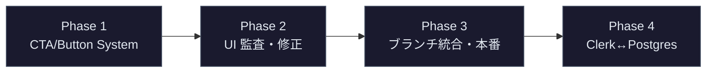
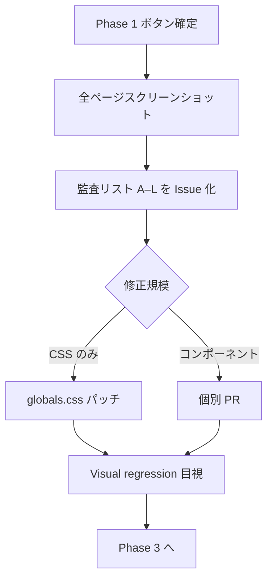
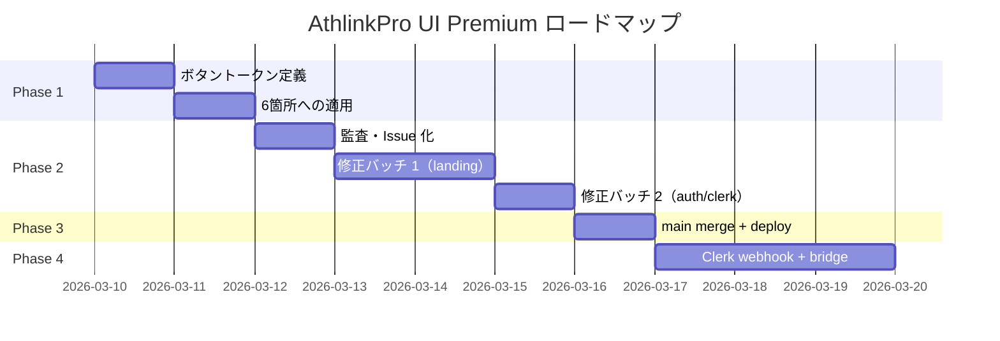

# AthlinkPro UI 進行計画書 — Premium / Apple-like 方向性

**作成日:** 2026年3月  
**前提ブランチ:** `cursor/header-logo-size-49e0`（セッション報告: `docs/SESSION-REPORT.md`）

---

## ビジョン

> **「Get started free」ボタンの枠・フォント・ランドセルっぽい青を、Apple サイトのような高級感仕様にする。シンプルな配色、余白、配置。そこを軸に、不自然・不統一な UI を段階的に洗い出して直す。**

### 現状の課題（ユーザー所感の整理）

| 現状 | 目指す状態 |
|------|-----------|
| シアン→ブルーの強い横グラデ（`#0891b2` → `#3b82f6`） | ニュートラルな黒/グレー基調 + **単一アクセント**（1 色のみ） |
| 太字 + シャインアニメ + 強い drop shadow | 控えめなタイポ、微細な hover、**質感より余白** |
| ヘッダー Clerk ボタンがデフォルト `Button`（グラデ CTA と別物） | **同一ボタンシステム**で header / hero / join / auth を統一 |
| コーチ（青）/ アスリート（クレイ）の二系統 CTA | ロール差は **アイコン・コピー** で表現、ボタン形状は共通 |

### 参考イメージ

- Apple.com: 白 or 黒の広い余白、1 アクションに 1 色、角丸は中程度、hover は opacity / scale のみ
- 禁止に近い表現: 小学校ランドセルブルーの蛍光感、多重グラデ、過剰な glow

---

## フェーズ概要



| Phase | 名称 | 優先度 | 工数目安 | 担当提案 |
|-------|------|--------|----------|----------|
| **1** | CTA / Button system redesign | **P0** | 1–2 日 | フロント（デザインリード） |
| **2** | 不自然点の洗い出しと修正 | **P0** | 2–4 日 | フロント |
| **3** | ブランチ統合・本番デプロイ | **P1** | 0.5–1 日 | TL + DevOps |
| **4** | Clerk ↔ Postgres ユーザーブリッジ | **P1** | 2–3 日 | バックエンド |

---

## Phase 1: CTA / Button System Redesign

**起点:** 「Get started free」（`nav_signup` / ヒーロー CTA）

### 1.1 デザイントークン定義

`src/app/globals.css` の CSS 変数を整理:

```css
/* 提案（Phase 1 で確定） */
--cta-bg: #0071e3;           /* Apple Blue 相当 — 単色 */
--cta-bg-hover: #0077ed;
--cta-text: #ffffff;
--cta-radius: 980px;         /* pill または 12px — 要デザイン判断 */
--cta-shadow: none;          /* または 0 1px 2px rgba(0,0,0,.2) */
--surface-primary: #000000;
--surface-secondary: #1d1d1f;
--text-primary: #f5f5f7;
--text-secondary: #86868b;
```

**削除・縮小対象**

- `--landing-grad-from` / `--landing-grad-to` を CTA から切り離す（背景装飾用に残すかは Phase 2 で判断）
- `.btn-landing-primary::after` シャインアニメ
- `box-shadow: 0 10px 28px rgba(37, 99, 235, 0.28)` 系

### 1.2 タイポグラフィ・余白・角丸・ホバー

| 属性 | 現状 | 目標 |
|------|------|------|
| font-weight | `font-bold`（700） | `font-medium`（500）または 600 |
| font-size | `text-sm` / `text-base` | 15–17px 固定スケール |
| padding | `h-12 px-6` | 縦 12px / 横 22px（Apple 近似） |
| border-radius | `rounded-xl`（12px） | pill（`rounded-full`）または 8px |
| hover | brightness + translateY + shadow | **opacity 0.88** または background 1 段階明るく |

### 1.3 適用範囲（優先順）

| 順 | 箇所 | ファイル | 備考 |
|----|------|----------|------|
| 1 | ランディング ヒーロー CTA | `src/app/page.tsx` L171–178 | `btn-landing-primary` |
| 2 | ヘッダー「Get started free」 | `src/components/layout/ClerkNavAuth.tsx` L21–23 | **現状デフォルト Button — 最優先で不一致解消** |
| 3 | ランディング フッター CTA | `src/app/page.tsx` L315 付近 | 二次 CTA |
| 4 | Join ゲートウェイ | `src/components/join/JoinGateway.tsx` L87–88 | coach / athlete 分岐 |
| 5 | オンボーディング | `src/app/onboarding/OnboardingClient.tsx` L58 | ロール別クラス統合 |
| 6 | アスリート LP | `src/app/page.tsx` L333、`AthleteHomeLanding.tsx` | `btn-athlete-primary` を共通 Primary に |

### 1.4 実装方針

1. **新クラス** `.btn-premium-primary` / `.btn-premium-secondary` を `globals.css` に追加（既存クラスは Phase 2 まで並存可）
2. または `src/components/ui/Button.tsx` に `variant="premium"` を追加し Tailwind `@apply` で集中管理
3. i18n ラベル `Get started free` は変更なし（コピーは Phase 2 で A/B 検討可）

**grep 起点コマンド（開発時）**

```bash
rg 'btn-landing-primary|btn-athlete-primary|Get started free|nav_signup' src/
```

---

## Phase 2: ボタン基準に沿った不自然点の洗い出しと修正

Phase 1 のボタンを **唯一のリファレンス** として、以下を監査リスト化し、スクリーンショット付きで Issue 化する。

### 2.1 監査リスト

| # | 領域 | ファイル / セレクタ | 問題 |
|---|------|---------------------|------|
| A | ランディング panels | `.land-panel`、`landing-band` | ボーダー/背景がボタンと別トーン |
| B | コーチカード | `src/components/coaches/CoachCard.tsx` | カード角丸・影が CTA と不整合 |
| C | Footer ticker | `src/app/page.tsx` フッター帯 | テキスト階層が弱い |
| D | Clerk ボタン不一致 | `ClerkNavAuth.tsx` vs ヒーロー CTA | **スタイル完全不一致（P0）** |
| E | Clerk カード内ボタン | `clerkAppearance.ts` `colorPrimary: #3b82f6` | Premium アクセント色に合わせる |
| F | Secondary CTA | `.btn-landing-secondary` | アウトライン太さ・hover |
| G | ヒーロー背景 | `.landing-hero-wash` | 背景グラデが CTA と競合 — 彩度を下げる |
| H | コーチセクション背景 | `.landing-coaches-band` | 同上 |
| I | LocaleSwitcher | `src/components/layout/LocaleSwitcher.tsx` | ヘッダー右端の視覚重量 |
| J | AppSidebar CTA | `AppSidebar.tsx` L209 | サイドバー内 Clerk ボタン |
| K | 認証ページ | `ClerkAuthShell.tsx` | ロゴ下余白 vs カード幅 |
| L | `/for-athletes` | `AthleteHomeLanding.tsx` | コーチ LP とのトーン差 |

### 2.2 作業フロー



### 2.3 受け入れ基準

- [ ] ヘッダー・ヒーロー・join の Primary CTA が **同一見た目**
- [ ] アクセント色が **1 色**（グラデなし）
- [ ] Clerk サインインカードの Primary がサイト CTA と **同一 hex**
- [ ] 背景グラデは CTA を損なわない彩度（L\* または saturation ≤ 現状の 60%）

---

## Phase 3: ブランチ統合・本番デプロイ

### 3.1 マージ戦略

1. `cursor/header-logo-size-49e0` を `main` に merge（23 commits、中間ブランチは不要）
2. Phase 1–2 の UI 変更は **同一ブランチに追記** または `cursor/premium-button-system-c19a` を切って merge
3. `main` マージ後 Vercel Production 再デプロイ

### 3.2 本番チェックリスト

- [ ] Vercel Production env: `CLERK_*`、`DATABASE_URL`、`SESSION_SECRET`
- [ ] Clerk Dashboard: Production instance、OAuth redirect URLs（athlink.com）
- [ ] DNS: `docs/DOMAIN.md` の A/CNAME 完了
- [ ] `npm run build` CI green
- [ ] スモークテスト: `/`、`/join`、`/sign-in`、`/coach/dashboard`

### 3.3 工数・担当

| タスク | 工数 | 担当 |
|--------|------|------|
| PR レビュー + merge | 2–4 h | TL |
| Vercel / Clerk / DNS | 2–4 h | DevOps |
| 本番スモーク | 1 h | QA / フロント |

---

## Phase 4: Clerk ↔ Postgres ユーザーブリッジ

UI 完成後、認証体験をデータモデルと接続する。

### 4.1 スコープ

| 項目 | 内容 |
|------|------|
| Webhook | Clerk `user.created` → `users` 行作成 |
| セッション統合 | Clerk `userId` と既存 `athlink_session` の共存 or 移行 |
| ロール | sign-up metadata（coach / athlete）→ `users.role` |
| オンボーディング | Clerk ログイン後 `/join` → `/onboarding` 導線を Postgres ユーザー ID で動作 |
| 管理画面 | Executive は従来 Cookie 認証を維持（Clerk 対象外でも可） |

### 4.2 関連ファイル（想定）

- 新規: `src/app/api/webhooks/clerk/route.ts`
- 既存: `src/lib/store.ts`、`src/lib/onboarding.ts`、Drizzle `users` スキーマ
- 参考: `docs/DATABASE.md`

### 4.3 工数・担当

| タスク | 工数 | 担当 |
|--------|------|------|
| Webhook + DB upsert | 1 日 | バックエンド |
| クライアント auth 状態統合 | 1 日 | フロント + バックエンド |
| E2E（Clerk test mode） | 0.5 日 | QA |

---

## タイムライン（技術依存関係）



※ 日付はプレースホルダー。Phase 1 完了を Phase 2 のブロッカーとする。

---

## 最初に触るファイル（クイックリファレンス）

| 目的 | パス |
|------|------|
| Primary CTA スタイル（現行） | `src/app/globals.css` — `.btn-landing-primary`（L699–735） |
| Secondary CTA | `src/app/globals.css` — `.btn-landing-secondary`（L775–） |
| Athlete CTA | `src/app/globals.css` — `.btn-athlete-primary`（L737–） |
| グラデ変数 | `src/app/globals.css` — `--landing-grad-from/to`（L79–80） |
| 「Get started free」ラベル | `src/lib/i18n/messages.ts` — `nav_signup` |
| ヒーロー CTA JSX | `src/app/page.tsx` L171–178 |
| ヘッダー auth ボタン | `src/components/layout/ClerkNavAuth.tsx` |
| Clerk テーマ | `src/components/auth/clerkAppearance.ts` |
| 汎用 Button | `src/components/ui/Button.tsx` |

---

## 成功指標

1. **主観:** 「Get started free」が Apple 系 SaaS のトップページと同程度の restraint 感がある
2. **客観:** Primary CTA の CSS 定義が **1 箇所** に集約され、6 以上の画面で同一 computed style
3. **リリース:** `main` + Production で Clerk OAuth が動作し、ランディングから join まで一貫した UI

---

## 関連ドキュメント

- `docs/SESSION-REPORT.md` — 本セッションまでの変更報告
- `docs/DEPLOY.md` — デプロイ手順
- `docs/DOMAIN.md` — ドメイン設定
