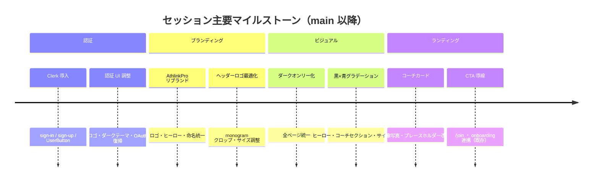
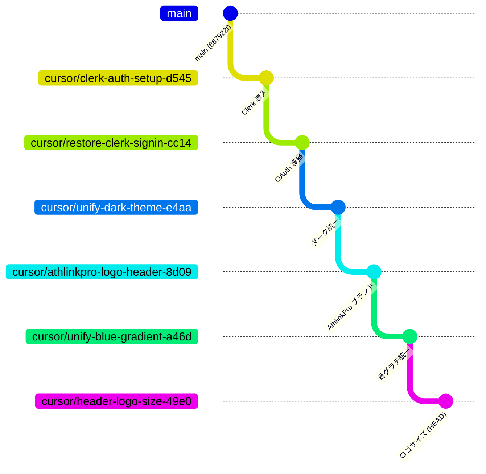

# AthlinkPro セッション報告書

**作成日:** 2026年3月  
**対象リポジトリ:** [athlink](https://github.com/)（Next.js 16 + Drizzle + PostgreSQL）  
**最新作業ブランチ:** `cursor/header-logo-size-49e0`（`main` より 23 コミット先行、未マージ）

---

## 概要 / 目的

本セッションでは、AthLink MVP を **AthlinkPro** ブランドへ統一し、公開向けの **Clerk 認証**、**ダークテーマ（黒×青グラデーション）**、**ランディング UI の刷新** を段階的に実装した。既存の管理画面（`/admin`）・コーチダッシュボード（`/coach/*`）・オンボーディングフローは維持しつつ、ファーストインプレッションと認証導線を Pro 仕様に近づけることが主目的である。



---

## 実施した変更一覧（カテゴリ別）

### 1. Clerk 認証

| 項目 | 内容 |
|------|------|
| パッケージ | `@clerk/nextjs` v7.8.4 を追加 |
| プロバイダ | `src/app/layout.tsx` に `ClerkProvider` を配置 |
| ルート | `/sign-in/[[...sign-in]]`、`/sign-up/[[...sign-up]]` |
| ナビ | `ClerkNavAuth` — SignIn / SignUp ボタン、ログイン後は `UserButton` |
| 配置箇所 | ランディングヘッダー、`AppShell`、`AppSidebar`、認証ページ |
| 外観 | `clerkAppearance.ts` — ダークカード、`colorPrimary: #3b82f6`、Clerk フッター非表示 |
| シェル | `ClerkAuthShell` — 認証カード上部に `AthlinkProLogo` |
| 経緯 | カスタム identifier トグル版（`cursor/clerk-signup-identifier-toggle-525e`）を試行後、**デフォルト Clerk + ソーシャル OAuth** に復帰（`cursor/restore-clerk-signin-cc14`） |

**関連ファイル**

- `src/app/sign-in/[[...sign-in]]/page.tsx`
- `src/app/sign-up/[[...sign-up]]/page.tsx`
- `src/components/layout/ClerkNavAuth.tsx`
- `src/components/auth/ClerkAuthShell.tsx`
- `src/components/auth/clerkAppearance.ts`
- `.env.example`（`CLERK_SECRET_KEY`、`NEXT_PUBLIC_CLERK_*`）

**未完了:** Clerk ユーザー ID と Postgres `users` テーブルのブリッジ（後述ロードマップ Phase 4）。

---

### 2. AthlinkPro ブランディング（ロゴ、ヒーロー、命名）

| 項目 | 内容 |
|------|------|
| ロゴコンポーネント | `AthlinkProLogo` — full / monogram、`onGradient` トーン対応 |
| ヒーローマーク | `AthlinkProMark` — アニメーション付きヒーロー表示 |
| テキスト表記 | ランディングを AthLink → **AthlinkPro** にリブランド |
| ヘッダー | 全主要レイアウトでテキストマークを `AthlinkProLogo`（monogram）に置換 |
| サイズ調整 | header サイズ `h-11 w-11`、グラデ背景上のブレンド修正（`tone="onGradient"`） |
| アセット | `/public/brand/athlinkpro-logo.png`、`athlinkpro-monogram.png` 等 |

**関連ファイル**

- `src/components/brand/AthlinkProLogo.tsx`
- `src/components/brand/AthlinkProMark.tsx`
- `src/app/page.tsx`（ヒーロー）
- `src/components/layout/AppShell.tsx`、`Header.tsx`、`AppSidebar.tsx`
- `src/components/join/JoinGateway.tsx`
- `src/components/athlete/AthleteHomeLanding.tsx`（`/for-athletes`）

---

### 3. ダークテーマ・黒×青グラデーション統一

| 項目 | 内容 |
|------|------|
| 方針 | ライト/ダーク切替を廃止し **ダークオンリー** に統一 |
| CSS 変数 | `--app-bg`、`--landing-hero`、`--landing-grad-from: #0891b2`、`--landing-grad-to: #3b82f6` |
| ヒーロー | 黒ベース + シアン/ブルーの animated wash（`landing-hero-wind`） |
| コーチセクション | 黒背景 + レイヤード cyan グラデーション（`landing-coaches-pattern-a/b`） |
| サイト全体 | `cursor/unify-blue-gradient-a46d` でランディング以外のページも同一パレットに |

**関連ファイル**

- `src/app/globals.css`（`:root` 変数、`.landing-hero-bg`、`.landing-coaches-band` 等）
- `src/app/layout.tsx`（`className="dark"` 固定）

**CTA ボタン（現状）**

- `.btn-landing-primary` — シアン→ブルーの横グラデ + シャインアニメ
- `.btn-landing-secondary` — アウトライン系
- `.btn-athlete-primary` — クレイ/アンバー系（アスリート向け `/for-athletes`、`/join`）

ラベル **「Get started free」** は `src/lib/i18n/messages.ts` の `nav_signup` / `signup_title` で定義。

---

### 4. ランディング UI（コーチセクション、肖像画、背景）

| 項目 | 内容 |
|------|------|
| スプラッシュ | `LandingSplash` — 初回表示アニメーション |
| 海岸線 SVG | `HeroCoastline` — ヒーロー下部装飾 |
| コーチカード | Dicebear アバターを廃止 → ブランクプレースホルダー → **プロ肖像写真** に更新 |
| フィーチャードコーチ | `/api/coaches` から verified コーチを最大 3 件表示（フォールバック: 静的データ） |
| CTA | ヒーロー「始める」→ `/join`、副 CTA → `/search` |
| 信頼帯 | `landing-band` — 都市・ベータ表記 |

**関連ファイル**

- `src/app/page.tsx`
- `src/components/coaches/CoachCard.tsx`
- `src/components/landing/LandingSplash.tsx`
- `src/components/landing/HeroCoastline.tsx`

---

### 5. 管理画面・コーチダッシュボード（既存・本セッション前から利用可能）

本セッションの UI ブランチでは大きな改修は行っていないが、MVP として以下が `main` に存在する。

| 領域 | パス | 概要 |
|------|------|------|
| エグゼクティブ管理 | `/admin/*` | 統計、コーチ申請、予約、監査ログ等（`docs/admin.md`） |
| コーチ | `/coach/register`、`/coach/dashboard`、`/coach/analytics`、`/coach/qr` | 登録・予約管理・分析 |
| 参加導線 | `/join` | コーチ/アスリート選択ゲートウェイ |
| オンボーディング | `/onboarding` | ロール別ウィザード |
| アスリート LP | `/for-athletes` | マーケティング向けホーム |

**デモアカウント（`npm run db:seed` 後）**

| ロール | Email | Password |
|--------|-------|----------|
| コーチ | `tanaka@athlink.app` | `Athlink2026!` |
| アスリート | `ethan.park@athlink.app` | `Athlink2026!` |
| エグゼクティブ | `ceo@athlink.app` | `Athlink2026!` |

※ Clerk 認証と従来のセッション Cookie 認証は **別系統**。Clerk 経由ログインは Postgres ユーザーと未連携。

---

## ブランチ一覧とマージ状況

すべて **`main` 未マージ**（2026-03 時点）。ブランチは **直列に積み上がる** 構成で、先頭が最新の完成状態である。

| ブランチ | 先頭コミット | 主な内容 | main との差分 |
|----------|-------------|----------|---------------|
| `cursor/clerk-auth-setup-d545` | `b97c637` | Clerk 初回導入、UserButton 修正 | +3 |
| `cursor/clerk-signup-identifier-toggle-525e` | `6bd6289` | カスタム sign-up/sign-in（**後続で superseded**） | — |
| `cursor/restore-clerk-signin-cc14` | `40d98b6` | デフォルト Clerk + OAuth 復帰 | +6 |
| `cursor/unify-dark-theme-e4aa` | `fa0295d` | 全ページダークオンリー | +7 |
| `cursor/athlinkpro-logo-header-8d09` | `8db9a22` | ロゴ・リブランド・コーチ肖像 | +16 |
| `cursor/unify-blue-gradient-a46d` | `d32799b` | サイト全体グラデーション統一 | +18 |
| **`cursor/header-logo-size-49e0`** | **`936be91`** | **ヘッダーロゴサイズ・グラデ上ブレンド（最新）** | **+23** |



**マージ推奨:** `cursor/header-logo-size-49e0` を 1 本に squash merge または linear merge するのが最も簡潔。中間ブランチ（`clerk-signup-identifier-toggle-525e` 等）は **マージ不要**（履歴に含まれるが最終状態で上書き済み）。

---

## 動作確認方法

### ローカル

```bash
git fetch origin
git checkout cursor/header-logo-size-49e0
cp .env.example .env.local
# DATABASE_URL, SESSION_SECRET, Clerk キーを設定
npm install
npm run db:push
npm run db:seed   # 任意
npm run dev
```

| URL | 確認内容 |
|-----|----------|
| http://localhost:3000 | ランディング（AthlinkPro ヒーロー、CTA、コーチセクション） |
| http://localhost:3000/join | コーチ/アスリート参加ゲート |
| http://localhost:3000/sign-in | Clerk サインイン（Google 等 OAuth） |
| http://localhost:3000/sign-up | Clerk サインアップ |
| http://localhost:3000/for-athletes | アスリート向け LP |
| http://localhost:3000/admin | エグゼクティブ管理（従来セッション認証） |
| http://localhost:3000/coach/dashboard | コーチダッシュボード（従来認証） |

### 本番 / ステージング

| URL | 状態 |
|-----|------|
| https://athlink-taupe.vercel.app | Vercel デフォルト URL（**main デプロイ = 本セッション変更未反映**） |
| https://athlink.com | DNS 設定待ち（`docs/DOMAIN.md` 参照） |

プレビュー: 各 feature ブランチの Vercel Preview Deployment で最新 UI を確認可能。

---

## 未完了・要手動対応

| 項目 | 詳細 | 担当想定 |
|------|------|----------|
| **Vercel 環境変数** | Production に `CLERK_SECRET_KEY`、`NEXT_PUBLIC_CLERK_PUBLISHABLE_KEY`、`NEXT_PUBLIC_CLERK_*_URL` を追加 | DevOps / インフラ |
| **Clerk Production** | 現在 Development インスタンス。本番ドメイン（athlink.com）用に Production インスタンス作成・OAuth リダイレクト URI 設定 | バックエンド |
| **PostgreSQL** | Neon 等の `DATABASE_URL` を Production に設定、`db:push` / `db:seed` | DevOps |
| **DNS** | athlink.com / www / mvp の A/CNAME レコード（a2dns.com） | ドメイン管理者 |
| **Clerk ↔ Postgres ブリッジ** | Clerk ログイン後も既存 `users` / コーチフローと連携していない | バックエンド |
| **feature ブランチの main マージ** | 23 コミット分が未リリース | フロント / TL |
| **UI 仕上げ** | CTA「Get started free」の randoseru ブルー感、Clerk ナビボタンとのスタイル不一致等 | フロント（→ `ROADMAP-UI-PREMIUM.md`） |

---

## 参考ドキュメント

- `docs/DEPLOY.md` — Vercel / Neon デプロイ手順
- `docs/DOMAIN.md` — athlink.com DNS
- `docs/admin.md` — エグゼクティブ管理画面
- `docs/DATABASE.md` — PostgreSQL スキーマ設計
- `docs/ROADMAP-UI-PREMIUM.md` — 今後の UI 改善計画
